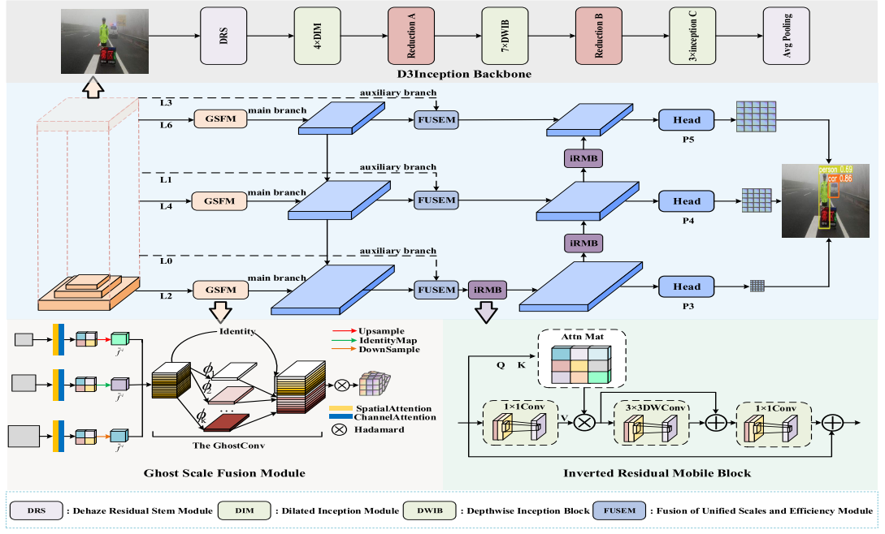
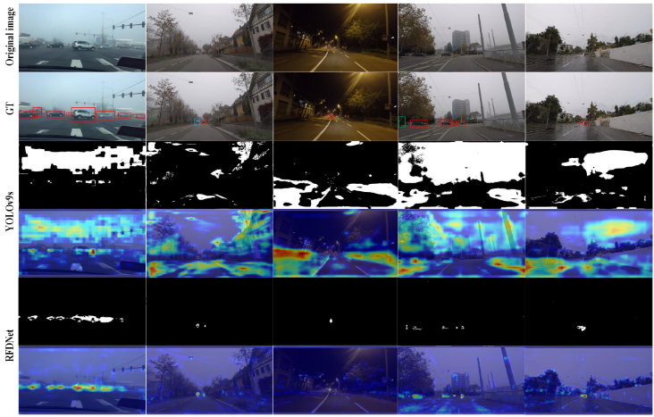
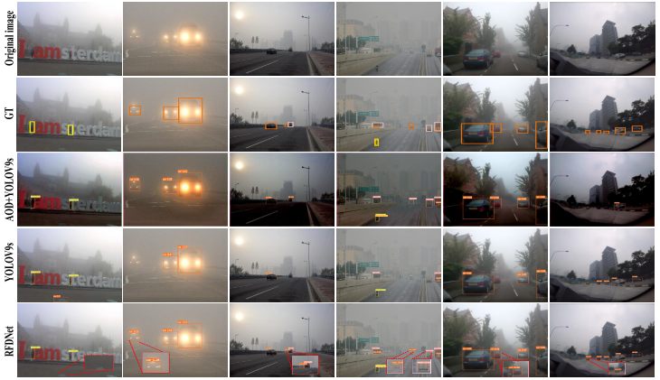
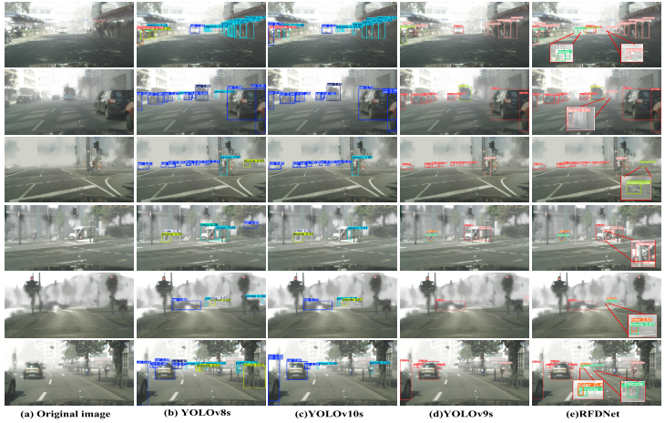
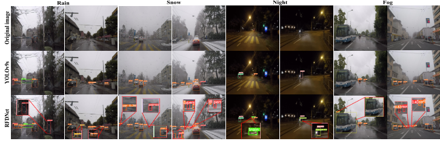

# RFDNet

This repository contains the core modules of RFDNet, including the D3Inception backbone, GSFM feature fusion module, IRMB attention module, and FUSEM feature fusion module.

This repository is intended to present the RFDNet network components themselves, not the full detection framework.

## Modules

- `D3Inception.py`: D3Inception backbone network. It integrates a defogging module, dilated convolution, and depthwise separable convolution to enhance feature representation in foggy traffic scenes. Residual connections are incorporated to preserve shallow features and improve robustness to foggy image inputs.
- `GSFM.py`: Ghost Scale Fusion Module (GSFM). It integrates local spatial features with global semantic information to reduce background interference and boundary ambiguity in foggy images. By combining spatial and channel attention mechanisms, GSFM improves boundary perception and category differentiation.
- `IRMB.py`: Inverted Residual Mobile Block (IRMB). It models long-range dependency relationships and improves the detection ability of occluded targets.
- `FUSEM.py`: Fusion of Unified Scales and Efficiency Module (FUSEM). It integrates multi-scale features from the main and auxiliary branches to enhance feature representation and semantic consistency.

## Visualizations

## Usage

The complete integration code, training configuration, and usage examples will be released progressively.
